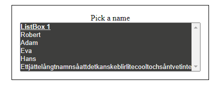
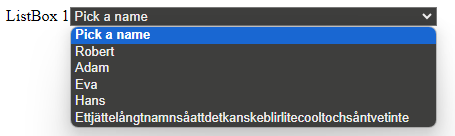

# List box kompontent

Jag har gjort en dropdown komponent som tar in följande props

```js
type ListBoxProps = {
  listItems: string[], // Listan med saker du vill ha med
  dropdownPlaceholder: string, // Din dropdown Placeholder
  dropdownLabel: string, // Din dropdown label
  multipleList: boolean, // Om du vill ha en lång lista eller en vanlig dropdown
  multipleListSize: number, // Antal saker som ska visas om du valt lista
  inlineDropdown: boolean, // En inline dropdown eller inte
  boxBorder: boolean, // Om du vill ha en border runt containern
  borderSizeInPixels: number, //Hur stor bordern ska vara
};
```

## Några exempel på hur det kan se ut

### Med Border och multilist

```js
<ListBox
  listItems={listItems}
  dropdownLabel="ListBox 1"
  dropdownPlaceholder="Pick a name"
  multipleList={true}
  multipleListSize={10}
  inlineDropdown={false}
  boxBorder={true}
  borderSizeInPixels={1}
/>
```



### Utan border och en inline

```js
<ListBox
  listItems={listItems}
  dropdownLabel="ListBox 1"
  dropdownPlaceholder="Pick a name"
  multipleList={false}
  multipleListSize={10}
  inlineDropdown={true}
  boxBorder={false}
  borderSizeInPixels={1}
/>
```


